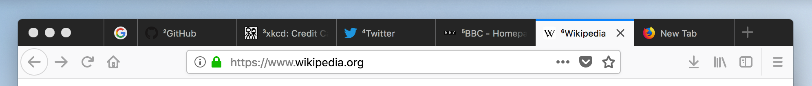

**NOTE 2021-06-11:** This extension is currently unmaintained. I abandoned this when I ended up using a Firefox `userChrome.css` addition (updated for Firefox 89):

```
tabs {
  counter-reset: tab-counter;
}

tab:nth-child(1) .tab-content::before,
tab:nth-child(2) .tab-content::before,
tab:nth-child(3) .tab-content::before,
tab:nth-child(4) .tab-content::before,
tab:nth-child(5) .tab-content::before,
tab:nth-child(6) .tab-content::before,
tab:nth-child(7) .tab-content::before,
tab:nth-child(8) .tab-content::before {
  counter-increment: tab-counter;
  content: counter(tab-counter) "";

  position: absolute;
  left: 24px;
  top: 7px;
  padding: 0px 4px;
  border-radius: 7px;

  opacity: .7;
  background: #ff0c;

  font-weight: bold;
  font-size: 80%;
}

/* show vertical lines between tabs */
tab:not(:first-child) {
  border-left: 1px solid #0004 !important;
}
```

* Pros: very robust; easy to customize styles
* Cons: harded to install than an extension. <a href="https://www.userchrome.org/how-create-userchrome-css.html">See instructions e.g. here</a>.

# tab-numbering
A browser extension for add numbering to tab titles. Uses WebExtensions API, and thus works on at least Chrome and Firefox.

Chrome:


Firefox:



This extension writes the tab number to the first eight tabs, the ones accessible with <kbd>ctrl</kbd>/<kbd>cmd</kbd> + *number*.

## How to install

- For Firefox: install from <a href="https://addons.mozilla.org/en-GB/firefox/addon/tab-numbering/">Mozilla Add-Ons</a>.
- For Chrome:
  1. Clone this repository to your machine
  2. Open <a href="chrome://extensions/">chrome://extensions/</a>
  3. Check **Developer mode**
  4. Click **Load unpacked extension...**
  5. Select the directory you cloned the repository into.

## Known issues

- does not add numbers to pinned tabs, internal error pages, "new tab" pages or other special tabs

- does not keep in sync when dragging tabs to/from another window

- will mess up with titles already starting with the characters `¹`...`⁸`
