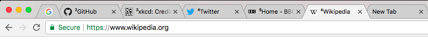

# tab-numbering
A browser extension for add numbering to tab titles. Uses WebExtensions API, and thus works on at least Chrome and Firefox.

This extension writes the tab number to the first eight tabs, the ones accessible with <kbd>ctrl</kbd>/<kbd>cmd</kbd> + *number*.

## Known issues

- does not add numbers to pinned tabs, internal error pages, "new tab" pages or other special tabs

- does not keep in sync when dragging tabs to/from another window

- will mess up with titles already starting with the characters `¹`...`⁸`
